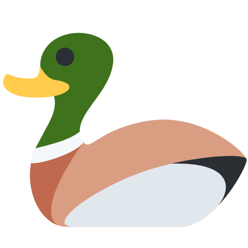

<br/>
<p align="center">
  
  <h3 align="center">Donald Component Library</h3>

  <p align="center">
    A curated list of awesome components crafted with love and care for DaisyUI.
    <br/>
    <br/>
    <a href="https://donald.github.io/"><strong>Explore the components</strong></a>
    <br/>
    <br/>
    <a href="https://github.com/thomasvergne/donald.css/issues">Report Bug</a>
    .
    <a href="https://github.com/thomasvergne/donald.css/issues">Request Feature</a>
  </p>
</p>

<div align="center">
  
 
 
 


</div>

## Table of Contents

- [About the Project](#about-the-project)
- [Getting Started](#getting-started)
  - [Installation](#installation)
- [Usage](#usage)
- [Contributing](#contributing)
- [License](#license)
- [Acknowledgements](#acknowledgements)

## About The Project

Donald is a curated list of awesome components crafted with love and care for DaisyUI.

It is built with [Tailwind CSS](https://tailwindcss.com/) and [DaisyUI](https://daisyui.com/). It is a collection of components that can be used in any project that uses both of theses libraries.

The website uses [Astro](https://astro.build/) to generate static pages and [Bun](https://bun.supermaya.io/) to manage the project.

## Getting Started

To get a local copy up and running follow these simple steps.

### Installation

1. Clone the repo
   ```sh
   git clone https://github.com/thomasvergne/donald.css.git
   ```

2. Install dependencies using Bun
    ```sh
    bun install
    ```

3. Start the development server
    ```sh
    bun dev
    ```

## Usage

You can just use the components by copying the code from the website (in `code` tab), and pasting it in your project.


## Contributing

Contributions are what make open-source communities such an amazing place to learn, inspire, and create. Any contributions you make are **greatly appreciated**.

- If you have suggestions for adding or removing projects, feel free to [open an issue](https://github.com/thomasvergne/donald.css/issues/new) to discuss it, or directly create a pull request after you edit the _README.md_ file with the necessary changes.
- Please make sure you check your spelling and grammar.
- Create individual PR for each suggestion.
- Please also read through the [Code Of Conduct](https://github.com/thomasvergne/donald.css/blob/main/CODE_OF_CONDUCT.md) before posting your first idea as well.

### Creating A Pull Request

1. Fork the Project
2. Create your Feature Branch (`git checkout -b feature/AmazingFeature`)
3. Commit your Changes (`git commit -m 'Add some AmazingFeature'`)
4. Push to the Branch (`git push origin feature/AmazingFeature`)
5. Open a Pull Request

## License

Distributed under the MIT License. See [LICENSE](https://github.com/thomasvergne/donald.css/blob/main/LICENSE.md) for more information.

## Acknowledgements

- [Tailwind CSS](https://tailwindcss.com/) - for providing the utility-first CSS framework
- [DaisyUI](https://daisyui.com/) - for providing the components
- [Astro](https://astro.build/) - for generating static pages
- [Bun](https://bun.sh/) - for managing the project
- [GitHub Pages](https://pages.github.com/) - for hosting the website
- [Lucide Icons](https://lucide.dev) - for using icons within components
- [TailwindUI](https://tailwindcss.com/plus) - for inspiration